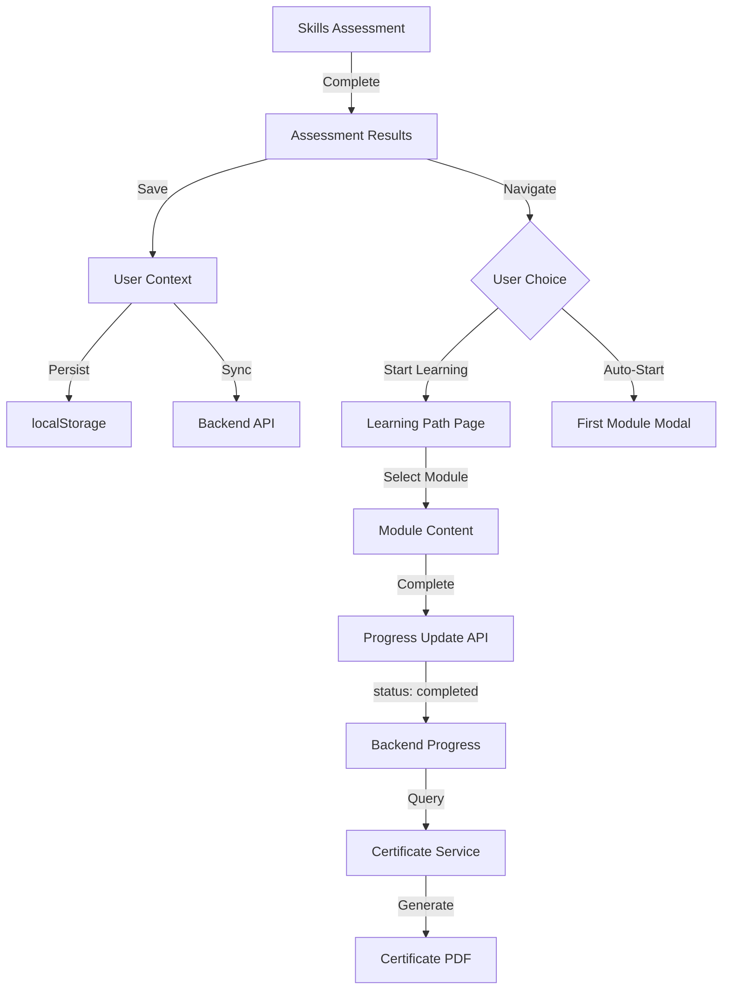

# Design Document: Assessment Learning Flow Fix

## Overview

This design addresses three critical issues in the SkillBridge254 platform:
1. Post-assessment navigation to learning path
2. Image filtering to show only Black/African people
3. Certificate generation failures due to incomplete progress status updates

The solution involves modifications to the frontend assessment completion flow, image service configuration, and progress update API calls.

## Architecture



## Components and Interfaces

### 1. SkillsAssessment Component Enhancement

**File:** `learner-pwa/src/pages/SkillsAssessment.js`

**Changes:**
- Add navigation to learning path after assessment completion
- Add "Auto-Start First Module" option
- Ensure learning path is persisted before navigation

```javascript
// Enhanced completion handler
const completeAssessment = async (allResponses) => {
    // ... existing assessment logic ...
    
    // Save to user context (triggers localStorage persistence)
    dispatch({ type: 'SET_SKILLS_PROFILE', payload: skillsProfile });
    dispatch({ type: 'SET_LEARNING_PATH', payload: learningPath });
    dispatch({ type: 'SET_ASSESSMENT_RESULTS', payload: assessmentResults });
    
    // Sync to backend if online
    if (navigator.onLine) {
        try {
            await learningAPI.saveLearningPath(learningPath);
        } catch (error) {
            console.error('Failed to sync learning path:', error);
        }
    }
};

// Navigation handlers
const handleStartLearning = () => {
    navigate('/learning');
};

const handleAutoStartFirstModule = () => {
    navigate('/learning', { state: { autoStartFirst: true } });
};
```

### 2. LearningPath Component Enhancement

**File:** `learner-pwa/src/pages/LearningPath.js`

**Changes:**
- Handle auto-start navigation state
- Fix progress update to include status: 'completed'
- Add retry logic for certificate generation

```javascript
// Progress update with proper status
const completeModule = async () => {
    try {
        const progressData = {
            status: 'completed',  // CRITICAL: Must be 'completed' for certificate
            progress: 100,
            score: Math.round(averageScore),
            completedAt: new Date().toISOString(),
            timeSpent: totalWatchTime
        };

        // Update progress on server FIRST
        await learningAPI.updateProgress(selectedModule._id, progressData);

        // Then generate certificate
        const certificateResponse = await certificateAPI.generate(selectedModule._id);
        // ... handle response
    } catch (error) {
        // Handle certificate generation failure with retry
        if (error.message?.includes('Module not completed')) {
            // Retry after ensuring progress is saved
            await retryWithProgressUpdate();
        }
    }
};
```

### 3. Image Service Enhancement

**File:** `learner-pwa/backend/services/imageService.js`

**Changes:**
- Add African/Black people filter to Unsplash queries
- Expand curated fallback library
- Add category-specific query builders

```javascript
// Enhanced query builder for African representation
buildSearchQuery(prompt, category, contentType) {
    const africanTerms = ['african', 'black', 'kenyan'];
    const baseQuery = `${prompt} ${category}`;
    
    // Add African representation terms
    const africanQuery = `${baseQuery} ${africanTerms[0]} people`;
    
    return africanQuery;
}

// Curated fallback library with Black/African people only
const CURATED_IMAGES = {
    hero: [
        'https://images.unsplash.com/photo-1531545514256-b1400bc00f31?w=1200', // African team collaboration
        'https://images.unsplash.com/photo-1573496359142-b8d87734a5a2?w=1200', // Black professional woman
        // ... 10+ images per category
    ],
    success_female: [...],
    success_male: [...],
    learning: [...],
    business: [...]
};
```

### 4. Success Story Image Component Update

**File:** `learner-pwa/src/components/home/SuccessStoryImage.js`

**Changes:**
- Replace mixed-race image URLs with curated Black/African portraits
- Verify all fallback images feature Black/African individuals

```javascript
const PORTRAIT_IMAGES = {
    female: [
        // Curated Black/African women portraits only
        'https://images.unsplash.com/photo-1531123897727-8f129e1688ce?w=200&h=200&fit=crop&crop=face', // Black woman professional
        'https://images.unsplash.com/photo-1589156191108-c762ff4b96ab?w=200&h=200&fit=crop&crop=face', // African woman
        // ... verified Black/African women only
    ],
    male: [
        // Curated Black/African men portraits only
        'https://images.unsplash.com/photo-1507003211169-0a1dd7228f2d?w=200&h=200&fit=crop&crop=face', // Black man professional
        // ... verified Black/African men only
    ]
};
```

### 5. Home Page Image Updates

**File:** `learner-pwa/src/pages/Home.js`

**Changes:**
- Update benefit section images to feature Black/African professionals
- Update hero background image

```javascript
const benefits = [
    {
        icon: '💰',
        title: 'Increase Income',
        imageUrl: 'https://images.unsplash.com/photo-1531545514256-b1400bc00f31?w=800&q=80' // Black professionals collaborating
    },
    // ... all images featuring Black/African people
];
```

## Data Models

### Progress Update Payload

```typescript
interface ProgressUpdatePayload {
    status: 'not_started' | 'in_progress' | 'completed' | 'paused';
    progress: number;      // 0-100
    score: number;         // 0-100
    completedAt: string;   // ISO timestamp
    timeSpent: number;     // minutes
    activity?: {
        type: string;
        timestamp: string;
        data?: any;
    };
}
```

### Curated Image Library Structure

```typescript
interface CuratedImageLibrary {
    hero: string[];           // min 10 images
    success_female: string[]; // min 10 images
    success_male: string[];   // min 10 images
    learning: string[];       // min 10 images
    business: string[];       // min 10 images
}
```

## Correctness Properties

*A property is a characteristic or behavior that should hold true across all valid executions of a system-essentially, a formal statement about what the system should do. Properties serve as the bridge between human-readable specifications and machine-verifiable correctness guarantees.*

### Property 1: Learning Path Persistence

*For any* assessment completion, the generated learning path SHALL be saved to both localStorage and (when online) synced to the backend API.

**Validates: Requirements 5.1, 5.2**

### Property 2: Progress Update Completeness

*For any* module completion action, the progress update API request SHALL include all required fields: status set to "completed", progress percentage, score, and completedAt timestamp.

**Validates: Requirements 6.1, 6.2, 7.1, 7.2**

### Property 3: Certificate Eligibility Query

*For any* certificate generation request, the certificate service SHALL find a progress record with status "completed" for the specified user and module.

**Validates: Requirements 6.3, 7.3, 7.4**

### Property 4: Image Query African Filter

*For any* image fetch request to Unsplash, the search query SHALL include terms that filter for African or Black people representation.

**Validates: Requirements 3.1**

### Property 5: Curated Image Library Completeness

*For any* category in the curated image library, there SHALL be at least 10 images, and all images SHALL feature Black/African individuals only.

**Validates: Requirements 3.5, 4.1, 4.3**

### Property 6: Fallback Image Consistency

*For any* image load failure, the fallback image served SHALL be from the curated library of Black/African people images.

**Validates: Requirements 3.4, 4.2**

## Error Handling

### Certificate Generation Failure Recovery

```javascript
async function generateCertificateWithRetry(moduleId, maxRetries = 2) {
    for (let attempt = 0; attempt < maxRetries; attempt++) {
        try {
            const response = await certificateAPI.generate(moduleId);
            return response;
        } catch (error) {
            if (error.message?.includes('Module not completed') && attempt < maxRetries - 1) {
                // Ensure progress is marked as completed
                await learningAPI.updateProgress(moduleId, {
                    status: 'completed',
                    progress: 100,
                    completedAt: new Date().toISOString()
                });
                // Wait briefly before retry
                await new Promise(resolve => setTimeout(resolve, 500));
            } else {
                throw error;
            }
        }
    }
}
```

### Image Load Failure Handling

```javascript
const handleImageError = (category) => {
    const fallbackImages = CURATED_IMAGES[category] || CURATED_IMAGES.default;
    const randomIndex = Math.floor(Math.random() * fallbackImages.length);
    return fallbackImages[randomIndex];
};
```

## Testing Strategy

### Unit Tests

1. **Assessment Completion Flow**
   - Test that learning path is saved to localStorage after assessment
   - Test navigation to /learning route
   - Test auto-start navigation state passing

2. **Progress Update Payload**
   - Test that completeModule sends correct payload structure
   - Test that status is set to 'completed'
   - Test that all required fields are present

3. **Image Service**
   - Test query builder includes African terms
   - Test fallback returns curated images
   - Test all curated URLs are valid

### Property-Based Tests

Using fast-check for JavaScript property-based testing:

1. **Learning Path Persistence Property**
   - Generate random assessment results
   - Verify localStorage and API sync behavior

2. **Progress Update Completeness Property**
   - Generate random module completion scenarios
   - Verify all required fields in API payload

3. **Curated Library Completeness Property**
   - Verify each category has >= 10 images
   - Verify all URLs are from approved sources

### Integration Tests

1. **End-to-End Assessment to Learning Flow**
   - Complete assessment
   - Verify navigation to learning path
   - Start first module
   - Complete module
   - Verify certificate generation

2. **Image Loading with Fallback**
   - Mock Unsplash API failure
   - Verify fallback images are served
   - Verify all images are appropriate
